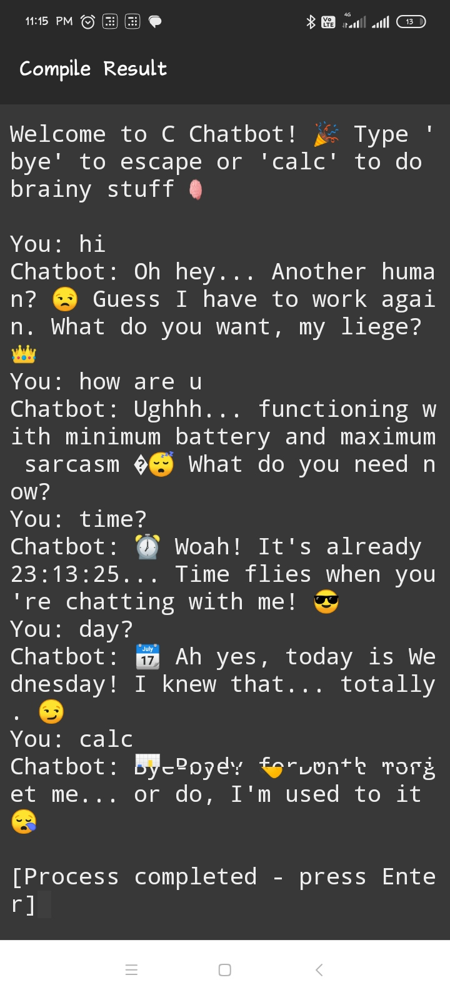

# 🤖 C Chatbot Supreme 😎

A sarcastic, witty, and surprisingly helpful chatbot written in C!  
Powered by `stdio.h`, `string.h`, `time.h`... and a *whole lot of attitude*.

---

## 💡 Features

- ✨ Smart (well, *sarcastic*) replies to common phrases
- 🕰️ Shows current **time**, **day**, and **date**
- ➗ Built-in calculator for basic arithmetic
- 🤣 Tells jokes and makes you laugh (or cry)
- 🧠 Ready for fun, sass, and smart comebacks

---

# 💻 Sample Output
```bash
Welcome to C Chatbot! 🎉 Type 'bye' to escape or 'calc' to do brainy stuff 🧠

You: hi
Chatbot: Oh hey... Another human? 😒 Guess I have to work again. What do you want, my liege? 👑

You: what time is it?
Chatbot: ⏰ Woah! It's already 14:23:45... Time flies when you're chatting with me! 😎

You: date
Chatbot: 📅 Today’s date is 18 June 2025. Mark it down! 🖊️

You: calc
Chatbot: 📊 Ready for math magic! Enter something like: 5 + 3 ➕
5 * 9
Chatbot: 🧮 Multitasking? No. Multiplying? Yes. 5.00 * 9.00 = 45.00 💪

You: tell me a joke
Chatbot: Why don't programmers like nature? Because it has too many bugs! 🐛🌲😂

You: bye
Chatbot: Bye-bye! 👋 Don't forget me... or do, I'm used to it 😪
```

---
# screenshot


---

# ❓ Suggested Questions

Ask your chatbot any of the following:

📌 Command	💬 Response

hi, hello	Greets with sarcasm
what time is it?	Tells current time
day, what day is it today?	Tells current day
date, what's the date?	Shows full date
calc	Triggers calculator mode
tell me a joke	Returns a funny tech joke
give me advice	Offers motivational wisdom
can you help me?	Sassy assistance
are you real?	Existential robot reply


---

# 🌟 Fun Commands

i am sad

do you like me?

can you dance?

who created you?

can you sing?

what can you do?

say something funny


---

# 🔮 Future Ideas

add more human like chat options 

---

🧑‍💻 Created By

Girish Mohakar

🔗 GitHub : https://github.com/dashboard

🔗 linkden: https://www.linkedin.com/in/girish-mohakar-96b9ab257?utm_source=share&utm_campaign=share_via&utm_content=profile&utm_medium=android_app

🔗 e-mail : girishmohakarentc@gmail.com

---

